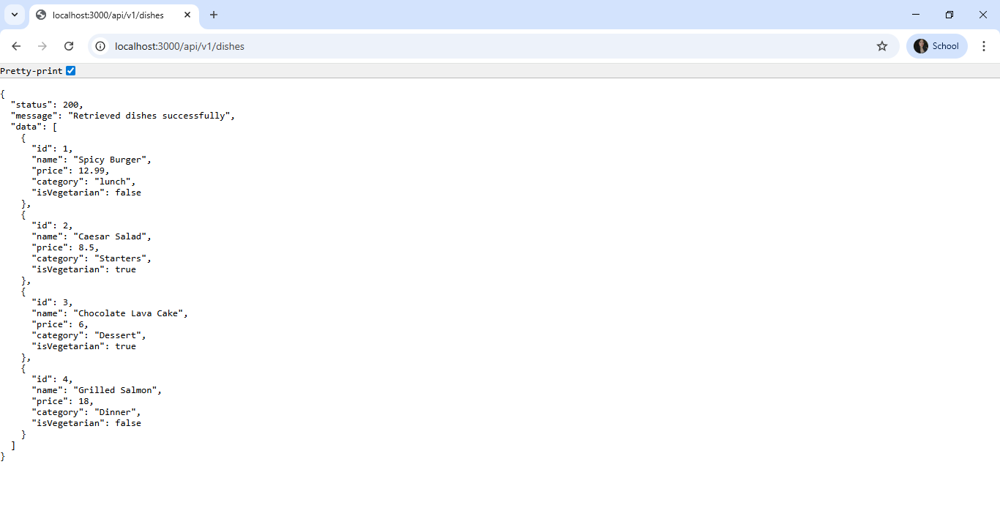

# RESTful API Activity - [JinahonShienaMarieB._3D]

## Best Practices Implementation

**1. Environment Variables:**
- Why did we put `BASE_URI` in `.env` instead of hardcoding it?
- Answer: Putting it in `.env` makes it easier to change the base URI without editing the code. It keeps the configuration separate and flexible for different environments like dev or production.

**2. Resource Modeling:**
- Why did we use plural nouns (e.g., `/dishes`) for our routes?
- Answer: Plural nouns are used because the routes represent collections of resources. It follows REST conventions and makes the API more intuitive - `/dishes` clearly refers to multiple dish items.

**3. Status Codes:**
- When do we use `201 Created` vs `200 OK`?
- Answer: `201` is used when creating a new resource with POST since something new was added. `200` is used for GET and PUT operations because they're just retrieving or updating existing data.

- Why is it important to return `404` instead of just an empty array or a generic error?
- Answer: `404` specifically indicates that the requested resource doesn't exist. An empty array just means no results, which is different from "not found." It provides clearer feedback and makes debugging easier.

**4. Testing:**

## Activity #3: Advanced Data Modeling

### Why I Chose to Embed Reviews

I chose to embed reviews directly into the Dish document because:

1. **Tight Coupling** - Reviews belong exclusively to a specific dish and have no meaning outside that context. When a dish is deleted, its reviews should be deleted too.

2. **Small Data Size** - Reviews are small (just user, rating, and comment), so even with many reviews, the document size stays manageable.

3. **Query Efficiency** - Embedding means one database query instead of two.

4. **No Independent Use** - Reviews don't need to be queried separately from dishes. I'll never search "all reviews by Dan" across all dishes.

### Why I Chose to Reference Chef

I chose to reference the Chef as a separate model because:

1. **One-to-Many Relationship** - One chef creates multiple dishes. Embedding would duplicate the same chef information across many documents, wasting storage.

2. **Data Integrity** - When a chef's information changes (e.g., new specialty), I update ONE chef document and all dishes automatically reflect the change.

3. **Independent Entity** - Chefs exist independently and can be queried separately: "Show me all chefs" or "Show me all dishes by Gordon Ramsay."

4. **Scalability** - Chef documents might grow to include biography, awards, experience, and photos. This would bloat dish documents if embedded.

